<a href="https://jirkapelikan.cz"><picture><source media="(max-width: 600px) and (prefers-color-scheme: light)" srcset="assets/light/uvod-m.svg"><source media="(max-width: 600px)" srcset="assets/dark/uvod-m.svg"><source media="(prefers-color-scheme: light)" srcset="assets/light/uvod.svg"></picture></a>

<a href="mailto:kontakt@jirkapelikan.cz"><picture><source media="(prefers-color-scheme: light)" srcset="assets/light/btn-mail.svg"></picture></a> <a href="https://jirkapelikan.cz"><picture><source media="(prefers-color-scheme: light)" srcset="assets/light/btn-web.svg"></picture></a> <a href="https://www.linkedin.com/in/ji%C5%99%C3%AD-pelik%C3%A1n-4655b0336/"><picture><source media="(prefers-color-scheme: light)" srcset="assets/light/btn-linkedin.svg"></picture></a> <a href="https://jirkapelikan.cz/en/"><picture><source media="(prefers-color-scheme: light)" srcset="assets/light/btn-en.svg">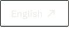</picture></a>

Nejvíc mě baví projekty, kde dělám všechno. Navrhnu, jak to bude vypadat, napíšu kód, nasadím to na server a pak sleduju, co lidi v praxi zdržuje. Bakalářku jsem obhájil na FIM UHK prací v Rustu o analýze síťového provozu a teď tam dělám magistra. Pracuju česky i anglicky, v Královéhradeckém kraji nebo na dálku.

## Jazyky

<picture><source media="(max-width: 600px) and (prefers-color-scheme: light)" srcset="assets/light/jazyky-m.svg"><source media="(max-width: 600px)" srcset="assets/dark/jazyky-m.svg"><source media="(prefers-color-scheme: light)" srcset="assets/light/jazyky.svg"></picture>

Podle objemu kódu ve veřejných repozitářích a v repozitářích projektů z webu, bez HTML a CSS.

## Stack

<table>
<tr><td><b>Jazyky</b></td><td><a href="https://github.com/Esperosa?tab=repositories&language=typescript"><picture><source media="(prefers-color-scheme: light)" srcset="assets/light/tech-ts.svg">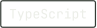</picture></a> <a href="https://github.com/Esperosa?tab=repositories&language=rust"><picture><source media="(prefers-color-scheme: light)" srcset="assets/light/tech-rust.svg">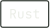</picture></a> <a href="https://github.com/Esperosa?tab=repositories&language=python"><picture><source media="(prefers-color-scheme: light)" srcset="assets/light/tech-python.svg">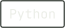</picture></a> <a href="https://github.com/Esperosa?tab=repositories&language=kotlin"><picture><source media="(prefers-color-scheme: light)" srcset="assets/light/tech-kotlin.svg">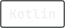</picture></a> <a href="https://github.com/Esperosa?tab=repositories&language=java"><picture><source media="(prefers-color-scheme: light)" srcset="assets/light/tech-java.svg">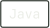</picture></a></td></tr>
<tr><td><b>Web a data</b></td><td><a href="https://jirkapelikan.cz/projekty/zskom/"><picture><source media="(prefers-color-scheme: light)" srcset="assets/light/tech-vue.svg"></picture></a> <a href="https://jirkapelikan.cz/projekty/ridoran/"><picture><source media="(prefers-color-scheme: light)" srcset="assets/light/tech-next.svg">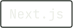</picture></a> <a href="https://jirkapelikan.cz/projekty/zskom/"><picture><source media="(prefers-color-scheme: light)" srcset="assets/light/tech-node.svg">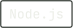</picture></a> <a href="https://jirkapelikan.cz/projekty/zskom/"><picture><source media="(prefers-color-scheme: light)" srcset="assets/light/tech-postgres.svg">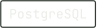</picture></a></td></tr>
<tr><td><b>Desktop a mobil</b></td><td><a href="https://jirkapelikan.cz/projekty/asian-taste/"><picture><source media="(prefers-color-scheme: light)" srcset="assets/light/tech-tauri.svg">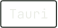</picture></a> <a href="https://jirkapelikan.cz/projekty/gamehub/"><picture><source media="(prefers-color-scheme: light)" srcset="assets/light/tech-pyside.svg">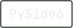</picture></a> <a href="https://jirkapelikan.cz/projekty/glyphhub/"><picture><source media="(prefers-color-scheme: light)" srcset="assets/light/tech-compose.svg">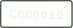</picture></a> <a href="https://jirkapelikan.cz/projekty/asian-taste/"><picture><source media="(prefers-color-scheme: light)" srcset="assets/light/tech-ffmpeg.svg">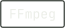</picture></a></td></tr>
<tr><td><b>Systémy a sítě</b></td><td><a href="https://jirkapelikan.cz/projekty/zskom/"><picture><source media="(prefers-color-scheme: light)" srcset="assets/light/tech-docker.svg">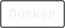</picture></a> <a href="https://jirkapelikan.cz/projekty/zskom/"><picture><source media="(prefers-color-scheme: light)" srcset="assets/light/tech-linux.svg">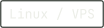</picture></a> <a href="https://jirkapelikan.cz/projekty/bakalarka/"><picture><source media="(prefers-color-scheme: light)" srcset="assets/light/tech-sit.svg">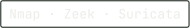</picture></a> <a href="https://jirkapelikan.cz/projekty/zskom/"><picture><source media="(prefers-color-scheme: light)" srcset="assets/light/tech-ci.svg">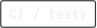</picture></a></td></tr>
<tr><td><b>Design</b></td><td><a href="https://jirkapelikan.cz/projekty/zskom/"><picture><source media="(prefers-color-scheme: light)" srcset="assets/light/tech-ui.svg">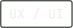</picture></a> <a href="https://jirkapelikan.cz/projekty/ridoran/"><picture><source media="(prefers-color-scheme: light)" srcset="assets/light/tech-identita.svg">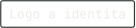</picture></a></td></tr>
</table>

Jazyky vedou na mé repozitáře v daném jazyce, ostatní štítky na projekt, kde je používám.

## Projekty

<code>01</code> <b>zskom.cz</b> · Web a redakční systém · 2026

 

<a href="https://jirkapelikan.cz/projekty/zskom/">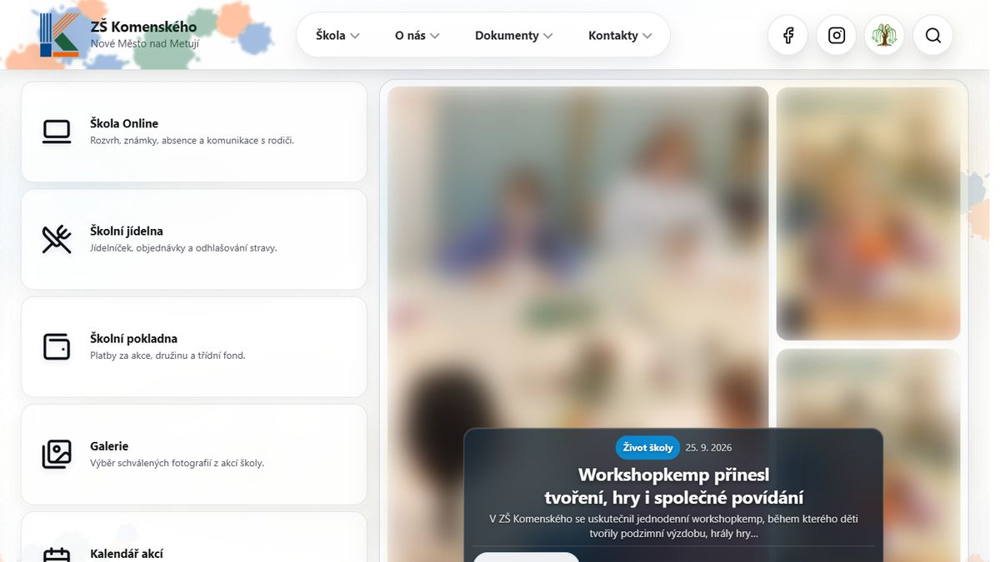</a>

Škola chtěla web, který si zvládne plnit sama. Postavil jsem ho celý, od návrhu přes vlastní redakční systém po server, na kterém běží. Článek z něj jde jedním klikem i na Facebook a Instagram.

- **Web se stará sám o sebe.** Plánované zveřejňování, denní zálohy mimo server, hlídání bezpečnosti a kontrola rozbitých odkazů běží automaticky. Nikdo na nic nemusí myslet.
- **Záloha, která opravdu funguje.** Obnovu jsem vyzkoušel naostro: databázi jsem smazal, obnovil a každý řádek i soubor seděl. Poškozenou zálohu systém odmítne dřív, než by cokoli přepsala.
- **Fotky dětí bez starostí s GDPR.** Obličeje jde rozmazat přímo v redakci při nahrávání, bez dalšího programu.
- **Pět pojistek před každým nasazením.** Každá změna projde pěti CI workflow a testy v prohlížeči, takže rodiče na rozbitý web nenarazí.

**V číslech:** v provozu od září 2026 · 702 commitů · 5 CI workflow 
**Technologie:** `TypeScript` `Vue / Nuxt` `Node.js` `PostgreSQL` `Rust` `Docker` `Linux / VPS` `CI / testy` `UX / UI`

[Stránka projektu](https://jirkapelikan.cz/projekty/zskom/) · [zskom.cz](https://zskom.cz)

<code>02</code> <b>Java CPU Path Tracer</b> · 3D renderer · 2026

 

<a href="https://jirkapelikan.cz/projekty/renderer/">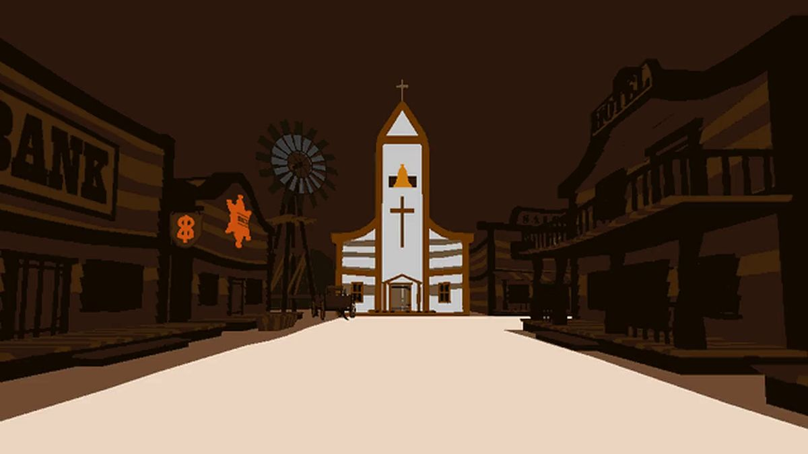</a>

Začalo to jako semestrální úloha a skončilo u vlastního path traceru. Čistá Java, žádné GPU, žádná grafická knihovna, jen matematika a procesor.

- **Žádné knihovny, žádné GPU.** 69 000 řádků vlastní Javy, od matematiky paprsků po odšumování. Vím, co je pod kapotou každého 3D enginu.
- **Změřený výkon.** Benchmarky bez okna: 5 ms na snímek při rasterizaci, 13 ms s ray tracerem, 39 ms s path tracerem.
- **Tři renderery, jedna scéna.** Stejný materiálový graf s 25 uzly používá rasterizace, ray tracer i path tracer, takže náhled odpovídá výsledku.
- **Instalace jedním klikem.** Instalátor pro Windows si Javu přinese s sebou, uživatel nic dalšího neřeší.

**V číslech:** BVH (SAH) · denoising · OBJ a glTF 
**Technologie:** `Java` `CI / testy`

[Stránka projektu](https://jirkapelikan.cz/projekty/renderer/) · [Kód na GitHubu](https://github.com/Esperosa/java-cpu-path-tracer)

<code>03</code> <b>Passive Traffic Analysis</b> · Bakalářská práce · bezpečnost · 2026

 

<a href="https://jirkapelikan.cz/projekty/bakalarka/">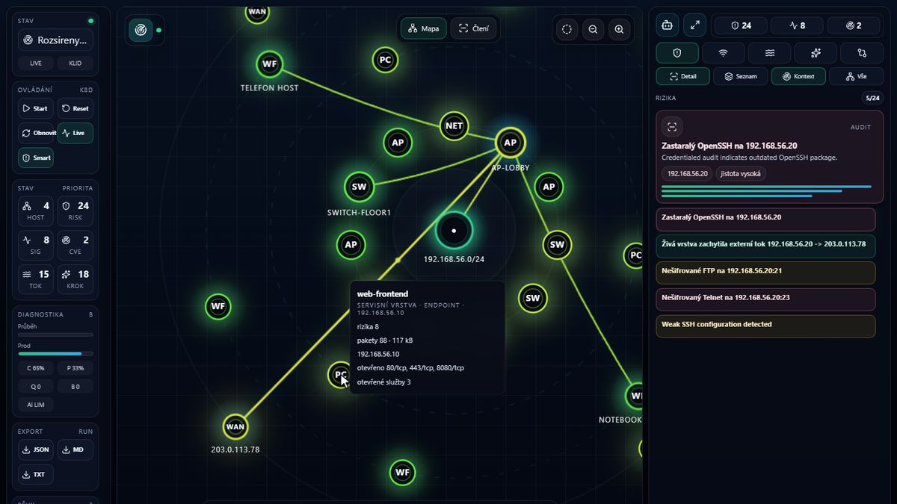</a>

Seznam otevřených portů nestačí. Můj nástroj v Rustu k nim dohledá známé zranitelnosti a spojí je s tím, co se v síti opravdu děje.

- **Nic neproklouzne.** Ve 242 testovacích scénářích nástroj zachytil všechno, co měl, s přesností 0,988.
- **Co opravit dřív.** Spojí inventář sítě, databáze zranitelností (CVE, EPSS, KEV) a provoz ze Zeeku a Suricaty do pořadí, co opravit dřív.
- **Důkazy pro audit.** Každá zpráva má otisk SHA-256, takže jde později doložit, že ji nikdo nezměnil.
- **Data zůstanou v síti.** Detekce je deterministická. Volitelný lokální model jen vysvětluje nálezy a nic neposílá ven.

**V číslech:** 27 000 řádků Rustu · 60 testů · obhájeno 2026 
**Technologie:** `Rust` `TypeScript` `Nmap · Zeek · Suricata` `PostgreSQL` `CI / testy` `UX / UI`

[Stránka projektu](https://jirkapelikan.cz/projekty/bakalarka/) · [Kód na GitHubu](https://github.com/Esperosa/service-fingerprinting-passive-analysis)

<code>04</code> <b>GameHub</b> · Desktopová aplikace · 2026

 

<a href="https://jirkapelikan.cz/projekty/gamehub/">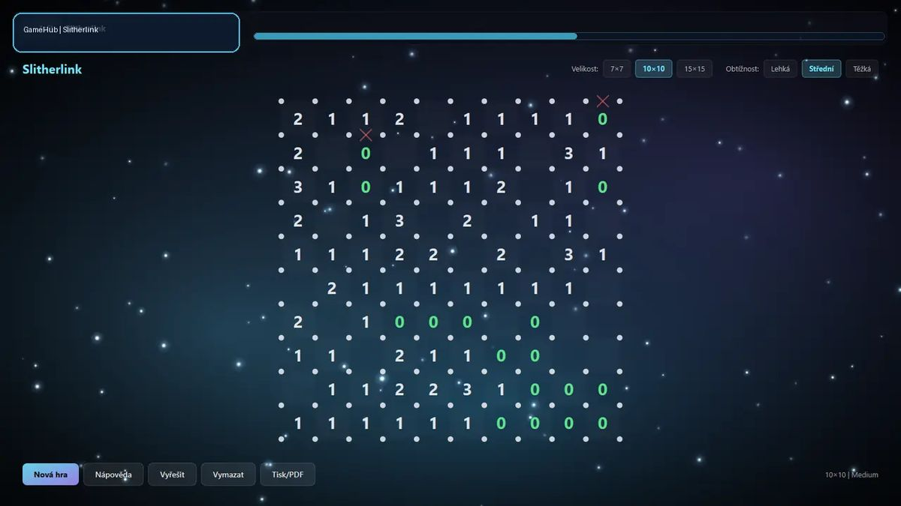</a>

Devět logických her a ke každé vlastní solver. 2048 hraje expectimax, Slitherlink řeší SAT solver a hádanky se dají vytisknout do PDF.

- **Optimalizace podle čísel.** Čtyři varianty generátoru jsem změřil na 30 zadáních a nechal nejrychlejší. Sudoku 16 × 16 vzniká o 16 % rychleji, v nejhorších případech o 35 %.
- **Slibuje jen to, co platí.** Tvrzení o solverech kontroluje skript. Když se ukázalo, že KenKen nemá vždy jediné řešení, slib z dokumentace zmizel.
- **Vydané jako produkt.** Releasy pro Windows i Linux s kontrolními součty, testy, CodeQL a automatickými aktualizacemi závislostí.

**V číslech:** 9 her · jádro v Rustu · releasy Win/Linux 
**Technologie:** `Python` `PySide6` `Rust` `CI / testy` `UX / UI`

[Stránka projektu](https://jirkapelikan.cz/projekty/gamehub/) · [Kód na GitHubu](https://github.com/Esperosa/gamehub)

<code>05</code> <b>GlyphHub</b> · Android aplikace · 2026

 

<a href="https://jirkapelikan.cz/projekty/glyphhub/"></a>

Nothing Phone má na zádech 169 LED diod. Napsal jsem aplikaci, která na ně dostane hodiny, vodováhu, časovač nebo rozvrh.

- **27 modulů na 169 diodách.** Hodiny, vodováha, kompas, metronom, ladička, rozvrh hodin a další. Všechno čitelné na matici 13 × 13.
- **Rozvrh ze ŠkolaOnline.** Záda telefonu ukážou, jestli je zrovna hodina, přestávka, nebo volno.
- **Sestaví se kdekoli.** SDK výrobce není v repozitáři. Aplikace si rozhraní najde za běhu, jinak použije náhradu, takže projekt jde sestavit na jakémkoli počítači.

**V číslech:** 27 modulů · Android 16 · 13 × 13 LED 
**Technologie:** `Kotlin` `Compose`

[Stránka projektu](https://jirkapelikan.cz/projekty/glyphhub/) · [Kód na GitHubu](https://github.com/Esperosa/GlyphHub)

<code>06</code> <b>Asian Taste Menu</b> · Zakázka · desktop a web · 2026

 

<a href="https://jirkapelikan.cz/projekty/asian-taste/">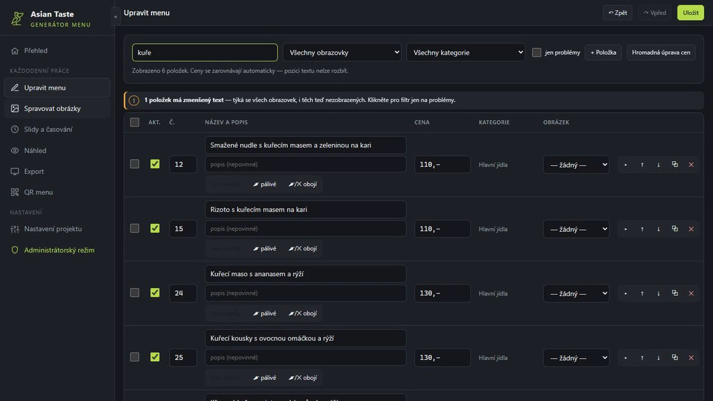</a>

Restaurace si mění ceny sama a menu se jí propíše na tři televize i do mobilu. QR kód na stolech zůstává pořád stejný.

- **Změna ceny bez večerního renderování.** Dvanáctihodinové video pro televizi vzniká z 800 snímků místo 216 000, protože se opakuje jedna smyčka.
- **Na televizi nedorazí rozbitý soubor.** Video dostane finální jméno, až když ho program zkontroluje. Flash disky pozná, naformátuje a pojmenuje sám.
- **Hromadné zdražení bez přepisování.** Ceny jde posunout o částku nebo procenta a formát jako „35,-“ nebo „od 129 Kč“ zůstane.
- **Čitelné přes celou restauraci.** Program hlídá velikost písma podle úhlopříčky televize a vzdálenosti hostů. Chyby zastaví export.

**V číslech:** video ve 4K · 270+ testů · v provozu 
**Technologie:** `Tauri` `Rust` `Vue / Nuxt` `TypeScript` `FFmpeg` `UX / UI`

[Stránka projektu](https://jirkapelikan.cz/projekty/asian-taste/)

<code>07</code> <b>Ridoran</b> · Identita a web · 2025

 

<a href="https://jirkapelikan.cz/projekty/ridoran/">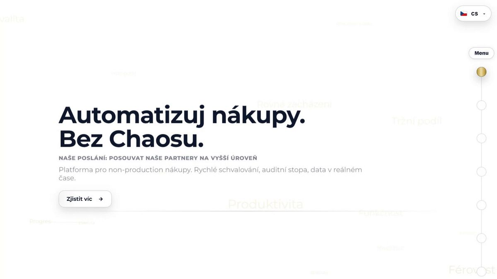</a>

Navrhl jsem logo, celou vizuální identitu a frontend webu platformy pro nevýrobní nákup. Backend dělal Martin Kubjak.

- **Jeden web pro tři trhy.** Čeština, angličtina a němčina ze statického Next.js, odpověď z CDN kolem 75 ms.
- **Abstraktní služba, kterou jde vyzkoušet.** Konfigurátor, ve kterém si návštěvník poskládá moduly a hned vidí dopad, a křivka, která provede nákupem krok po kroku.
- **Značka od loga po web.** Logo, vizuální styl i frontend z jedné ruky, takže všechno drží pohromadě.

**V číslech:** logo a identita · CZ · EN · DE · v provozu 
**Technologie:** `Next.js` `TypeScript` `UX / UI` `Logo a identita`

[Stránka projektu](https://jirkapelikan.cz/projekty/ridoran/) · [ridoran.cz](https://www.ridoran.cz)

## Aktivita

<picture><source media="(max-width: 600px) and (prefers-color-scheme: light)" srcset="assets/light/aktivita-m.svg"><source media="(max-width: 600px)" srcset="assets/dark/aktivita-m.svg"><source media="(prefers-color-scheme: light)" srcset="assets/light/aktivita.svg"></picture>

## Kontakt

Máte projekt nebo volné místo? Napište mi na **[kontakt@jirkapelikan.cz](mailto:kontakt@jirkapelikan.cz)**, ozvu se do dvou pracovních dnů.
Celé portfolio s ukázkami je na **[jirkapelikan.cz](https://jirkapelikan.cz)**.
