<a href="https://jirkapelikan.cz"><picture><source media="(max-width: 600px)" srcset="assets/uvod-m.svg"></picture></a>

<a href="mailto:kontakt@jirkapelikan.cz"><picture><source media="(max-width: 600px)" srcset="assets/btn-mail-m.svg"></picture></a>
<a href="https://jirkapelikan.cz"><picture><source media="(max-width: 600px)" srcset="assets/btn-web-m.svg">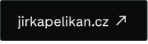</picture></a>
<a href="https://www.linkedin.com/in/ji%C5%99%C3%AD-pelik%C3%A1n-4655b0336/"><picture><source media="(max-width: 600px)" srcset="assets/btn-linkedin-m.svg"></picture></a>

 

<picture><source media="(max-width: 600px)" srcset="assets/h-01-m.svg"></picture>

<picture><source media="(max-width: 600px)" srcset="assets/stack-m.svg"></picture>

 

<picture><source media="(max-width: 600px)" srcset="assets/h-02-m.svg"></picture>

<picture><source media="(max-width: 600px)" srcset="assets/github-m.svg"></picture>

 

<picture><source media="(max-width: 600px)" srcset="assets/h-03-m.svg"></picture>

<a href="https://jirkapelikan.cz/projekty/zskom/"><picture><source media="(max-width: 600px)" srcset="assets/karta-zskom-m.svg">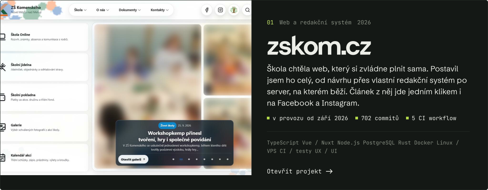</picture></a>

<a href="https://jirkapelikan.cz/projekty/renderer/"><picture><source media="(max-width: 600px)" srcset="assets/karta-renderer-m.svg"></picture></a>

<a href="https://jirkapelikan.cz/projekty/bakalarka/"><picture><source media="(max-width: 600px)" srcset="assets/karta-bakalarka-m.svg">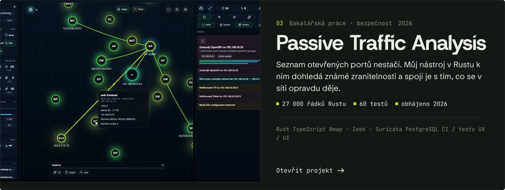</picture></a>

<a href="https://jirkapelikan.cz/projekty/gamehub/"><picture><source media="(max-width: 600px)" srcset="assets/karta-gamehub-m.svg"></picture></a>

<a href="https://jirkapelikan.cz/projekty/glyphhub/"><picture><source media="(max-width: 600px)" srcset="assets/karta-glyphhub-m.svg"></picture></a>

<a href="https://jirkapelikan.cz/projekty/asian-taste/"><picture><source media="(max-width: 600px)" srcset="assets/karta-asian-taste-m.svg"></picture></a>

<a href="https://jirkapelikan.cz/projekty/ridoran/"><picture><source media="(max-width: 600px)" srcset="assets/karta-ridoran-m.svg">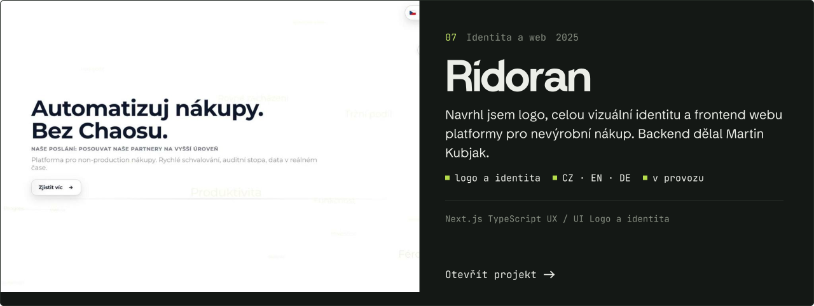</picture></a>

 

<b>Bc. Jiří Pelikán</b> · Softwarový inženýr a UX/UI designér · Software engineer and UX/UI designer 
<a href="https://jirkapelikan.cz">jirkapelikan.cz</a> · <a href="mailto:kontakt@jirkapelikan.cz">kontakt@jirkapelikan.cz</a> · <a href="https://www.linkedin.com/in/ji%C5%99%C3%AD-pelik%C3%A1n-4655b0336/">LinkedIn</a> · <a href="https://jirkapelikan.cz/en/">English</a>

